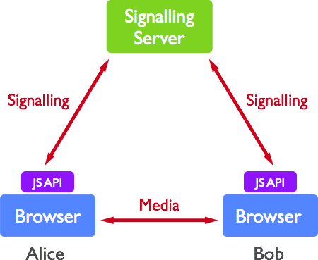
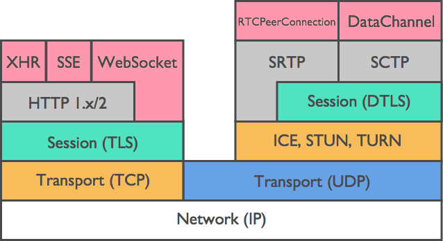
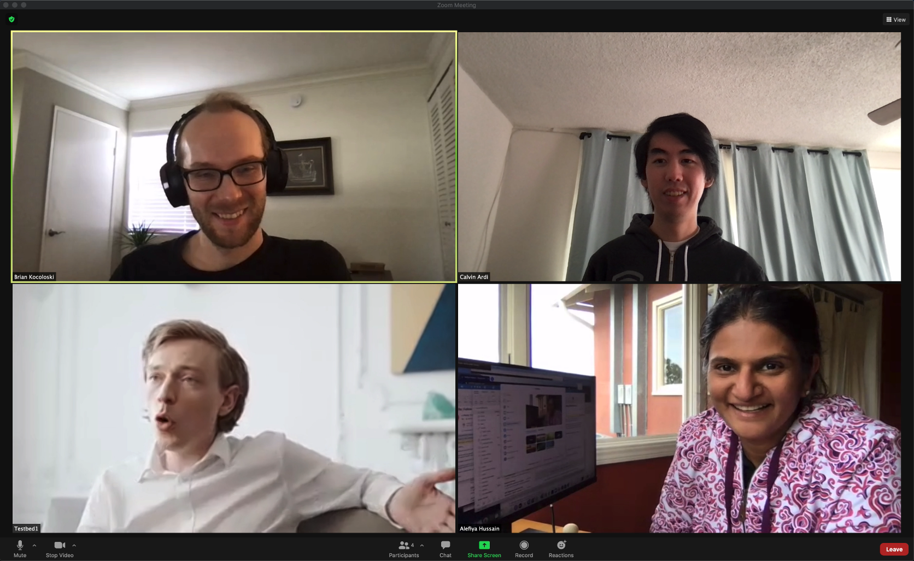

# Video Teleconferencing (VTC)

**VTC** is defined as two-way traffic, consisting of separate
audio and video streams, between two or more endpoints.

[[_TOC_]]

## General Questions
Some overarching testing questions across any VTC solution we decide to
use:
- how do we simulate the webcam for each endpoint?
    * See: [Virtual Devices](#Virtual Devices)
- how do we instrument and measure A/V quality?
    * See: [Metrics](#Metrics) We expect quality to vary as bandwidth is limited. 

## Technologies
A number of technologies serve as building blocks for automated VTC traffic generation on a testbed. 

### Virtual Devices
Test and evaluation tasks on the testbed require a capability to automatically generate VTC traffic. In order to emulate the real world with the highest fidelity possible we need to use real VTC software on the testbed. These software packages are primarily meant to accept input streams from cameras and microphones, not static video and audio files on disk. Rather than using real devices and capturing live content, we rely on virtual devices to provide streaming content feeds (audio and visual) to the VTC packages. 

#### Virtual Camera
The virtual camera is based on a [Video4Linux](https://www.kernel.org/doc/html/v4.9/media/uapi/v4l/v4l2.html) device. The [v4l2loopback](https://github.com/umlaeute/v4l2loopback) kernel module allows you to create "virtual video devices". Normal (v4l2) applications will read these devices as if they were ordinary video devices, but the video will not be read from a camera or video capture card but instead it is generated by another application.  

In our case, we use [gstreamer](https://gstreamer.freedesktop.org/) to create a media pipeline, streaming a video file from disk to the virtual camera device. This device can be selected in the VTC application UI (e.g. Zoom client), and the video is displayed. 

Steps for configuring virtual camera:
1. Make kernel module [v4l2loopback](https://github.com/umlaeute/v4l2loopback)
1. Load kernel module to device `/dev/video5`: `# modprobe v4l2loopback video_nr=5`
1. Make sure [v4l2loopback](https://github.com/umlaeute/v4l2loopback) kernel module is loaded and `/dev/video5` exists. (`$ lsmod`, then look for `v412loopback`)
1. Install [gstreamer](https://gstreamer.freedesktop.org/documentation/installing/on-linux.html)
1. Locate source video file (see path below for free source VTC video files.
1. Launch gstreamer pipeline: `$ gst-launch-1.0 -v filesrc location=<video_filename.mp4> ! decodebin ! videoconvert ! "video/x-raw,format=YUY2" ! v4l2sink device=/dev/video5`
1. Select the appropriate camera device in the VTC UI.

Note:
* Alternative virtual camera driver: [akvcam](https://github.com/webcamoid/akvcam)

To Do:
- Configure video pipeline to repeatedly stream video file or cycle through multiple files
- Automate virtual camera device selection in target VTC clients

#### Virtual Microphone

The virtual microphone is based on ALSA loopback device [snd_aloop](https://www.alsa-project.org/wiki/Matrix:Module-aloop). Like the virtual camera, the virtual microphone is a a kernel module. Normal applications will read these devices as if they were ordinary microphones, but the audio will be generated by another application. 

Steps for configuring virtual microphone:
1. Load `snd_aloop` kernel module: `# modprobe snd_aloop`
1. Verify loopback devices present with: `$ aplay -l`
1. Play WAV file with `aplay -D <device_name> <filename.wav>
1. Select the appropriate microphone device in the VTC UI. 

* Note, for highest fidelity emulation use WAV audio files, not necessarily because sound quality matters, but because we are emulating low-level microphone devices and audio compression happens wwithin the VTC application, not the device typically. 

### VTC Media Content
Driving VTC sessions requires feeding media content (audio and visual) into the virtual devices. This media content must approximate what we'd see in the real world, and it we must have rights to use it in our testbed. 

#### Video sources
Video content should represent people talking toward a camera. Preferably this content is roughly 720p or 1080p resolution, and the VTC application can re-scale as necessary. Audio is handled via a separate virtual device, so an audio track or dialogue is not necessary. Participant focus in VTC apps is typically done by applying a thresholding algorithm on the audio device, not video, so a constantly moving video feed does not pose a problem and realistic pauses are not necessary. 

Free source VTC videos: `/zfs/pharos/pcaps/vtc/source_videos/`

#### Audio source generation

**TBD** - generate speech audio files from text to speech package reading generated natural language (GPT-2). Must have natural cadence and pauses for n-way communication. Create sentence library with male and female voices. Stream audio into loopback device, looping as necessary. Audio must be cut by issuing new streaming commands while pausing to avoid stealing VTC focus. 

Script audio and video streaming with input parameters:
 * gender
 * duration
 * number of participants

### Device Scripting
Audio and video devices need to be scripted to approximate real participants in a VTC session. Looped streaming of video feeds through the virtual device is a starting point. One simple improvement is to pause the video stream when another bot is talking. Realistic VTC requires a more sophisticated approach for the audio feeds. The audio conversation must vary and in order to prevent one participant from hogging the VTC focus the audio devices must have pauses proportional to the number of participants in the VTC.

### WebRTC
WebRTC (Web Real-Time Communication) is a free, open-source project that provides web browsers and mobile applications with real-time communication (RTC) via simple application programming interfaces (APIs). It allows audio and video communication to work inside web pages by allowing direct peer-to-peer communication, eliminating the need to install plugins or download native apps. WebRTC is **not** a VTC application; it is a set of javascript APIs that can be incorporated into a VTC application.

[WebRTC Security & Technology](https://webrtc-security.github.io/)
The video traffic on the wire in WebRTC is called the DataChannel, and this traffic has several properties:
* UDP (not TCP)
* Encrypted with DTLS by default
* Typically peer-to-peer (P2P), though Jitsi Videobridge is an exception for >2 party VTC sessions.

A simple WebRTC Call Topology

WebRTC Protocol Stack

#### Automating WebRTC
A simple skeleton program is being built that demonstrates webRTC VTC capabilities. This can potentially be automated by directly hooking into the Javascript, or by driving a web browser with a tool like [Selenium](https://www.selenium.dev/). 

_2021-02-03 update: WebRTC application development paused because it is a lower priority than further developing virtual devices and deploying Jitsi Meet to the testbed._

## Self Hosted VTC Systems
Some VTC systems can be entirely self-hosted and do not rely on external services. These are well suited for testbed use because they can offer complete control of configuration and instrumentation and do not require external communication bandwidth. However, the underlying technology and user experience may differ from widely adopted commercial VTC solutions. 

### Jitsi Meet
Jitsi is a collection of free and open-source multiplatform voice (VoIP), videoconferencing, and instant messaging applications for the web platform, Windows, Linux, macOS, iOS, and Android. Jitsi Meet is an open source JavaScript WebRTC application and can be used for videoconferencing.

**Status:** We have deployed Jitsi Meet in development environments. This still needs to be further tested and developed into a testbed capability. _2021-02-03_

### Other Self Hosted VTC Systems
- [Element Matrix](https://element.io/): open-source Slack/Mattermost with VTC capabilities
- etc.

## Commercial Cloud VTC Services
Commercial cloud VTC services are paid or free services offering VTC capabilities where the servers are owned and operated by a third party. Users access the VTC services via clients that can be mobile, browser-based, or standalone binaries. The server provides signaling, videobridge, and various ancillary functionality that cannot be replicated locally. 

Examples include:
- [Zoom](https://zoom.us/)
- Google [Hangouts](https://hangouts.google.com/) / [Meet](https://meet.google.com/) 
- [Microsoft Teams](https://www.microsoft.com/en-us/microsoft-teams/group-chat-software)
- etc. 

Cloud VTC services are the most widely adopted VTC solutions, so they represent a valuable class of systems for realistic test and evaluation purposes. However, they have several notable drawbacks, primarily because they cannot be replicated entirely in the testbed:
- External bandwidth demands are high due to the streaming video nature of VTC, particularly when many clients are active.
- Cloud VTC services require sending data over the public internet, potentially introducing many artifacts to the laboratory-like testbed environment.
- A large number of user accounts must be purchased and maintained for large scale testing. 

### Small scale testing 
As shown above, virtual devices can be used to feed content into any VTC client. This allows us to programmatically drive a commercial VTC service with prerecorded footage from within our testbed or development environments. However, this requires real accounts on the VTC service and we have limited external bandwidth on our testbeds, so we are limited to very small scale experiments. At the moment driving commercial cloud services is primarily useful to us in the following ways:

- Technology demonstration
- Packet capture - we can assemble a pcap dataset drawn from the most popular VTC services for replay or analysis. 

#### Zoom
We have demonstrated the virtual device technology on Zoom and captured videos from a live Zoom meeting. These videos can be found here: `/zfs/pharos/pcaps/vtc/zoom_screencaps/`

#### Skype
_Not currently under consideration as of 2020-10-02._

* Skype requires Windows, provisioned Skype clients, and outbound Internet
* Internet access does introduce interesting "uncertainty" as traffic
  routes through public Internet

## Metrics
**TBD**
- Bandwidth
- Latency
- Video quality
- Audio quality
- "Perceived quality"

Some rough numbers:
> I did some simple tests to see how much throughput different VTCs were
> using. So far I've looked at: Zoom, Google Meet, and Jitsi Meet. I'll be
> able to test Skype (at least audio-only) during our Searchlight sync on
> Monday.
> 
> - Zoom, 4 participants
>   * audio + video: 330 KBps (down) / 150 KBps (up)
> 
> - Google Meet, 2 participants
>   * audio-only: ~6 KBps (down) / ~6 KBps (up)
>   * audio + video: 80-100 KBps (down) / 150-300 KBps (up)
>   * no audio (muted), no video (turned off camera): 0 (down) / 40-60 KBps (up)
>     - even with "no activity" I'm sending quite a bit to Google...
> 
> - Jitsi Meet, 2 participants
>   * audio + video: ~200 KBps (down) / 300 KBps (up)
> 
> - Skype, 6 participants
>   * audio only: ~3-8 KBps (down) / { 0.6 KBps (up, when muted), 3-6
>     KBps (up, when transmitting) }
> 
> There are lots of variables that can affect these numbers: presumably
> each service wants to minimize the amount of bandwidth needed, but will
> happily grab more if it's available.
> 
> For example, I used the Mac's built-in webcam (720p @ 30fps), which is
> roughly 3000 kbps (375 KBps). If someone had a 4K-quality camera, I'm
> wondering if each service would upload the highest quality possible.
> 
> At some point next week I'll try to see if these numbers are consistent
> as the number of participants increase. If I joined a Zoom call with
> 10+, would the throughput also increase linearly? (I wouldn't think so.)

## Traffic Analysis

### Zoom

Zoom web client (browser) seems to use a combination of custom signaling
with a standardized (H.264?) codec over WebRTC Data channels (as of
2019?) and, previously, WebSockets.

Unknown if the Zoom applications (mobile, desktop) use similar
technology or a separate, custom stack.

- [Zoom avoids using WebRTC (2019)](https://webrtchacks.com/zoom-avoids-using-webrtc/)
- [WebRTC vs Zoom. Who has Better Video Quality? (2018)](https://bloggeek.me/webrtc-vs-zoom-video-quality/)
- [When will Zoom use WebRTC?](https://bloggeek.me/when-will-zoom-use-webrtc/)

## Testbed Deployment
**TBD**

### Desktop Client Automation

- Browser: Playwright, Selenium, etc.
- Desktop:
    * Windows: AutoHotKey
    * Linux:
        - [SikuliX](https://github.com/RaiMan/SikuliX1) (Java, OpenCV)
        - [UI.Vision](https://ui.vision/)

Key words for desktop automation: "RPA" (Robotic Process Automation)
